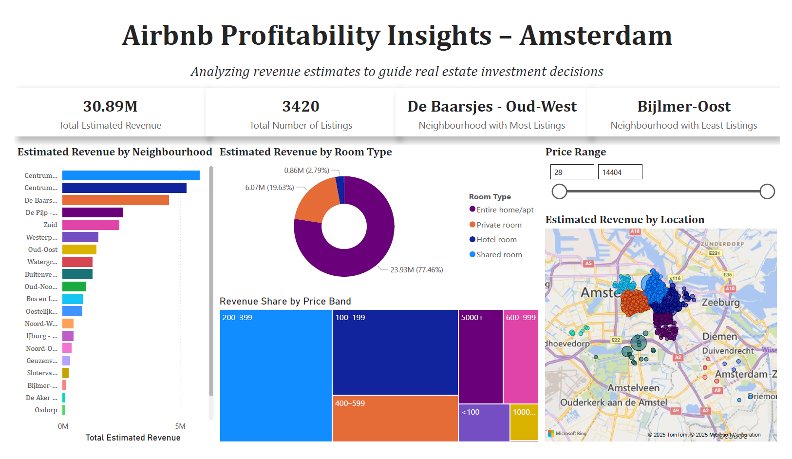

# Airbnb Profitability Insights – Amsterdam

### *Analyzing revenue estimates to guide real estate investment decisions*

This project explores Airbnb listings in Amsterdam to uncover insights about potential revenue generation across different neighborhoods and room types. Using Power BI, we estimate each listing's annual revenue based on availability and pricing patterns, helping prospective real estate investors make informed decisions.

The analysis is built upon data from [Inside Airbnb](https://insideairbnb.com/get-the-data/), a publicly available source that offers detailed snapshots of Airbnb activity across global cities. The dataset used here includes two key components: listings (property-level data) and calendar (date-level availability and price data).

---

## 📊 Dashboard Preview

---

## 🧠 About the Analysis

The dashboard includes:

- **Revenue Estimates** per listing, neighborhood, and room type  
- **Geographic insights** using a map visualization  
- **Interactive slicer** to filter listings by price range  
- **Summary KPIs** for quick high-level insights  

https://github.com/user-attachments/assets/401b2da7-00bc-4f78-bb2d-035714582525

> Note: All prices are in USD as per the original dataset from Inside Airbnb. Actual revenues may vary due to factors like maintenance downtime, owner usage, and unlisted bookings. Revenue shown here is an estimate, assuming non-available dates are equivalent to booked dates.
---

## 📁 How to View the Dashboard

To interact with the dashboard:

1. Download the `.pbix` file from this repository.
2. Open it in [Power BI Desktop](https://powerbi.microsoft.com/desktop/), available for free.
3. Use the slicer and visual filters to explore listings by price, neighborhood, and room type.

---

## 🛠 Tools Used

- **Power BI**
- **Power Query**
- **DAX** (basic measures for KPIs)
